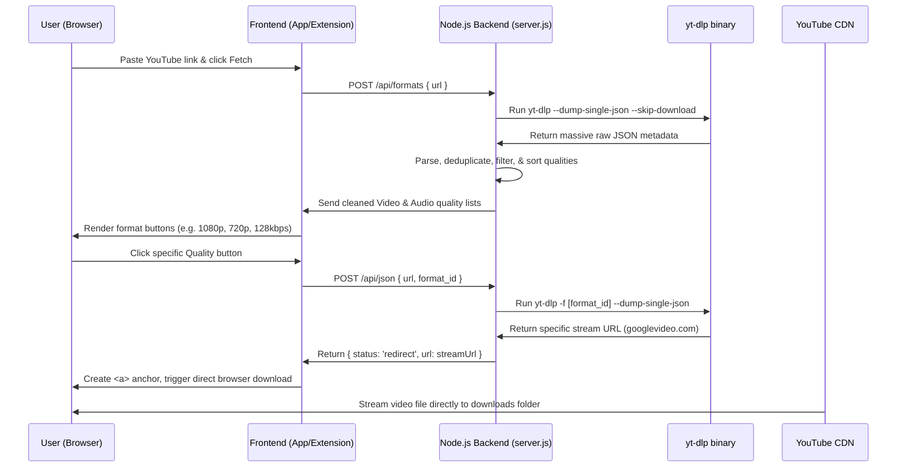

# 🏴‍☠️ Destopian Pirate: YouTube Video Download & Quality Selection Guide

This document details the step-by-step technical implementation of the media extraction, format sorting, and download sequence utilized by the **Destopian Video Grabber** extension and web page.

---

## 🚀 1. The Core Extraction Method
Rather than relying on third-party APIs (like Cobalt, which blocked automated extension calls with Cloudflare Turnstile JWT verification), we use a **custom Node.js backend** that wraps **`yt-dlp`** via the `youtube-dl-exec` npm library. 

`yt-dlp` is the industry standard for command-line media extraction. It is updated constantly to keep up with YouTube's code changes and signature cipher updates.

---

## 📈 2. Sequential Step-by-Step Flow

Below is the execution sequence when a user downloads a YouTube video:



### Detailed Sequence:

### Step 1: Requesting Format List (`POST /api/formats`)
When a YouTube link is loaded, the client sends a `POST` request to the `/api/formats` endpoint. 
The backend spawns `yt-dlp` asynchronously using the following configuration options:
*   `dumpSingleJson: true` — Tells `yt-dlp` to dump the video info as a single JSON string instead of downloading the video.
*   `skipDownload: true` — Prevents writing any media files to the disk.
*   `noWarnings: true` — Keeps the logs clean.

### Step 2: Categorizing, Deduplicating & Filtering Formats
The raw JSON returned by `yt-dlp` contains hundreds of potential stream combinations (separate video-only streams, audio-only streams, and pre-muxed video+audio streams). The server parses this data inside [server.js](file:///c:/Users/DELL/OneDrive/Desktop/destopianpirate/complaint/destopian-server/server.js) to build a user-friendly quality selector:

1.  **Deduplication**: We keep track of formats we've already added using a `seen` Set.
2.  **Video Selection**: 
    *   We inspect every format `f`. If the format has a video codec (`f.vcodec && f.vcodec !== 'none'`), we extract its resolution height (e.g., `1080`, `720`).
    *   We check that the URL is a direct download link (`f.url.startsWith('http')`).
    *   Unique formats are deduped by mapping them to `${f.height}-${f.ext}`. This ensures the user isn't shown multiple copies of `720p mp4`.
3.  **Audio Selection**:
    *   If the format has an audio codec but no video (`f.acodec && f.acodec !== 'none' && (!f.vcodec || f.vcodec === 'none')`), it is classified as audio.
    *   Unique formats are deduped mapping to `audio-${f.abr}-${f.ext}` where `abr` is the audio bitrate (e.g. `128kbps`, `256kbps`).
4.  **Sorting**:
    *   Videos are sorted **descending** by height: `(b.height || 0) - (a.height || 0)`.
    *   Audios are sorted **descending** by audio bitrate (ABR): `(b.abr || 0) - (a.abr || 0)`.

This clean, sorted array is returned to the frontend.

### Step 3: Stream URL Retrieval (`POST /api/json`)
When the user selects a format:
1.  The client requests `/api/json` passing the original `url` and the specific `format_id` (e.g. `137` for 1080p video, or `140` for M4A audio).
2.  The backend runs `yt-dlp` passing the format option:
    ```javascript
    const output = await youtubedl(url, {
      dumpSingleJson: true,
      format: format_id // Specific format requested
    });
    ```
3.  `yt-dlp` processes YouTube's cipher signatures and extracts the direct Google Video CDN URL (e.g. `https://rr---sn-....googlevideo.com/...`).
4.  The server returns the URL to the client.

### Step 4: Browser-Side Direct Download
To trigger a download without buffering the file on our server (which would slow down downloads and waste server bandwidth), we stream the file directly from YouTube's CDN to the user's browser.

In [app.js](file:///c:/Users/DELL/OneDrive/Desktop/destopianpirate/complaint/destopian-server/public/app.js#L130-L151), the frontend does the following:
```javascript
const a = document.createElement('a');
a.href = data.url; // Google Video CDN link
a.download = title + '.' + ext; // Suggest output filename
a.target = '_blank';
a.rel = 'noopener';
document.body.appendChild(a);
a.click();
document.body.removeChild(a);
```
This forces the browser to open the stream and start saving it directly to the user's downloads folder.

---

## 🛠 3. Handling Special Platforms (TeraBox, DiskWala, etc.)
Due to strict client-side encryption (like **AppiCrypt** bot verification headers, dynamic session keys, and login/cookie checks) implemented on services like **TeraBox** and **DiskWala**, server-side scrapers cannot resolve these direct stream URLs programmatically.

To handle these:
1.  **Server Protection**: The server blocks these domains using [handleCloudStorageRestriction](file:///c:/Users/DELL/OneDrive/Desktop/destopianpirate/complaint/destopian-server/server.js#L29-L49) middleware.
2.  **Extension Handover**: When a user attempts to process a DiskWala or TeraBox link, they are instructed to open the link in their browser. 
3.  **Active Tab Scanning**: Since our Chrome Extension runs on all tabs, once the user opens the link in their browser and plays the video, the extension's **Video Scanner** (`scanForVideos()` inside [content.js](file:///c:/Users/DELL/OneDrive/Desktop/destopianpirate/complaint/video-grabber/content.js#L10-L91)) intercepts the active player element (`<video>` tags, `currentSrc` feeds, or `<source>` tags) and extracts the stream URL directly from the page DOM after the browser has completed the decryption. The user can then click the hover download button to download it immediately!
